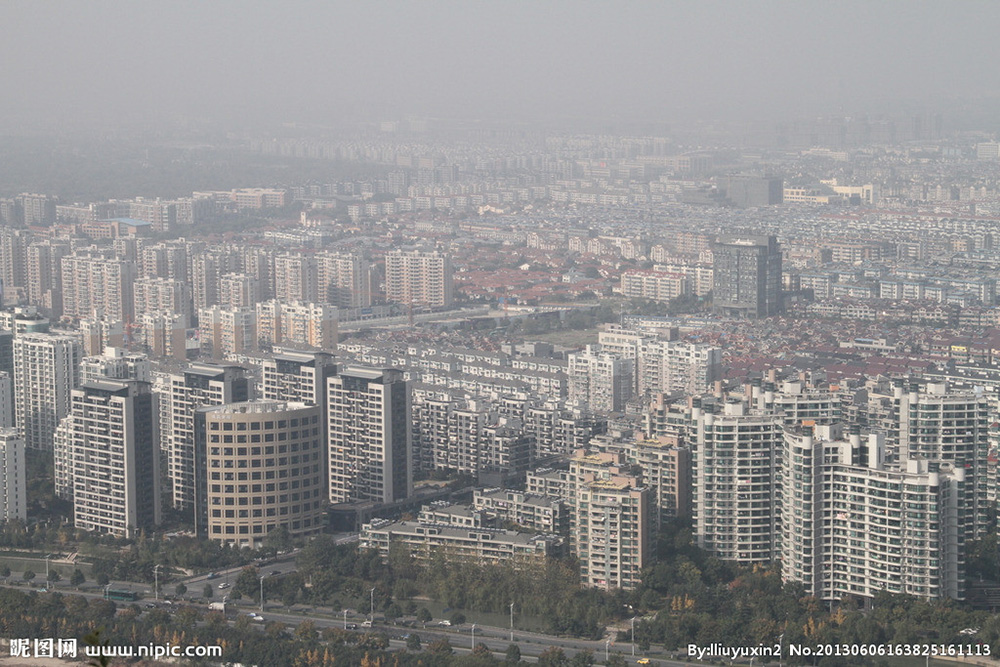

# Possion-Blender

A personal implement of a Siggraph Paper **Poisson Image Editing**

## Usage

Now we have two pictures: A and B, and we need to cling B onto A with A as the background. 

**Picture A**

**Picture B**

* if we directly add B onto A, there exists obvious boundary, which seems not natural enough:

* if we use Possion Blendering tools, after we solve the possion equation, we get a more natural blendering result:

##Note

In my project, I solve the equation by using **Gaussian-Sadel** Iteration to acclerate. That means when we solve 

$$AX=b$$

we can construct an iteration as:

$$X^{k+1}=B_G X^{k}+f_G$$

where 

$$B_G=(D-L)^{-1}U$$

$$f_G=(D-L)^{-1}b$$

$$A=D+L+U$$

